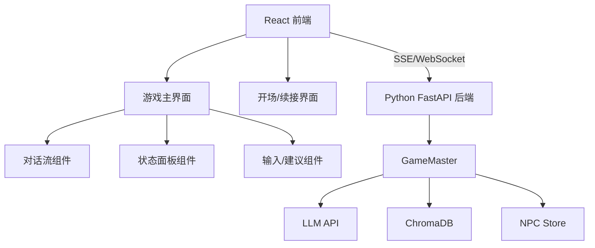

## 1. 架构设计

## 2. 技术说明

- **前端**: React + Vite + Tailwind CSS
- **后端**: Python FastAPI（轻量级，与现有 GameMaster 集成）
- **流式传输**: Server-Sent Events (SSE)
- **无数据库**: 复用现有的 ChromaDB + JSON 存档

## 3. 路由定义

| 路由 | 用途 |
|------|------|
| / | 游戏主界面 |
| /api/start | 开始新游戏 |
| /api/load | 加载存档 |
| /api/action | 发送玩家行动（SSE 流式返回） |
| /api/dice | 投骰子 |
| /api/status | 获取玩家状态 |
| /api/command | 执行 ! 命令 |

## 4. API 定义

### 4.1 POST /api/action
请求: `{ "action": "我走到窗边" }`
响应 (SSE): 流式文本 chunks + 最终 JSON `{ "narration": "...", "suggestions": [...], "state": {...} }`

### 4.2 GET /api/status
响应: `{ "hp": 10, "max_hp": 10, "madness": 0, "emotion": "calm", "trust": 0.5, "stamina": "fresh" }`
